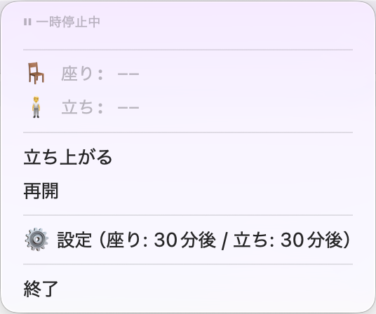
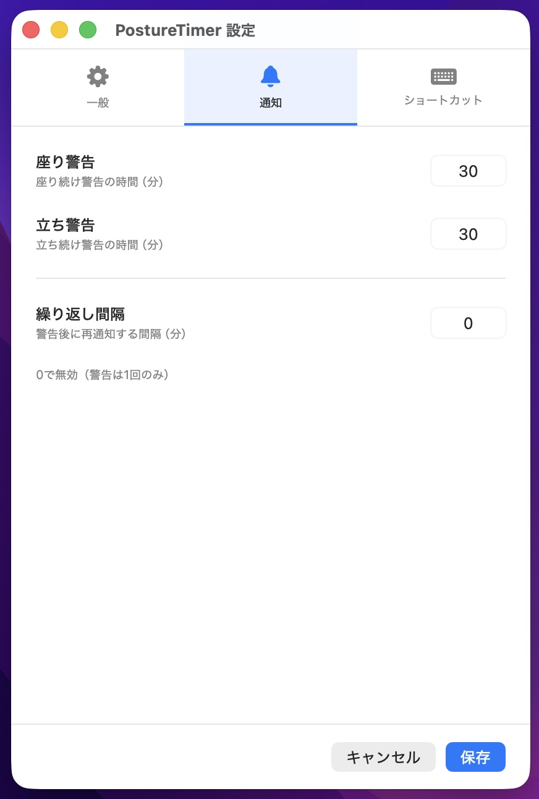

# PostureTimer

macOS のメニューバーに常駐する着座タイマー。
長時間の座り続け／立ち続けを検知して通知し、姿勢のリズムを整えます。

---

## スクリーンショット

<!-- 実際のスクリーンショットを撮影して assets/screenshots/ に配置してください -->

### メニューバー表示

*左から: 座り中 / 立ち中 / 一時停止*

### メニュー

### 設定画面

---

## 機能

- **メニューバー常駐** — 🪑 / 🧍 アイコンと現在のセッション経過時間をリアルタイム表示
- **状態切り替え** — メニュークリックまたはグローバルホットキー（既定 `⌘⌃S`）で「座り ↔ 立ち」をトグル
- **一時停止 / 再開** — メニューまたは既定 `⌘⌃P` で一時停止／再開（一時停止中は経過時間がカウントされない）
- **警告通知** — 同じ姿勢が指定分数続くと macOS バナー通知を発火（繰り返し再通知も間隔を設定可能）
- **ログイン時自動起動** — 設定「一般」タブから ON / OFF
- **ホットキーのカスタマイズ** — 設定「ショートカット」タブから自由に変更可能

---

## 要件

- macOS 13.0 (Ventura) 以上
- ビルドする場合: Xcode 15 以上 / Swift 5.9 以上

---

## インストール

### リリース版から (推奨)

1. [Releases ページ](https://github.com/ykich/posture-timer-app/releases) から最新の `PostureTimer-vX.Y.Z.zip` をダウンロード
2. zip を展開し、`PostureTimer.app` を `/Applications/` に配置
3. **初回起動**: アイコンを **右クリック → 「開く」**(Gatekeeper の警告が出ますが、「開く」を選んでください)
   - これは配布アプリが Apple のコード署名・公証(notarization)を経ていないためです
   - 一度許可すれば次回以降は通常のダブルクリックで起動できます

### ソースからビルド

`docs/RUNBOOK.md` を参照してください。

---

## 使い方

メニューバーのアイコンをクリックするとメニューが開きます。

| 操作 | 方法 |
|------|------|
| 座り / 立ち切り替え | 「立ち上がる / 座る」をクリック または `⌘⌃S` |
| 一時停止 / 再開 | 「一時停止 / 再開」をクリック または `⌘⌃P` |
| 警告時間の変更 | 「⚙️ 設定」→「通知」タブ |
| ログイン時起動 | 「⚙️ 設定」→「一般」タブ |
| ショートカット変更 | 「⚙️ 設定」→「ショートカット」タブ |
| 終了 | メニュー「終了」 |

---

## 権限について

- **通知** — 初回起動時にリクエストされます。通知が出ない場合は システム設定 → 通知 → PostureTimer → 「通知を許可」を ON にしてください。
- **アクセシビリティ** — グローバルホットキーを利用するために必要です。設定画面「ショートカット」タブにステータス表示と「システム設定でアクセシビリティを開く」ボタンがあります。

---

## データ保存場所

設定値は macOS の `UserDefaults` に保存されます（`appConfig` キー配下に `sit_alert_minutes` / `stand_alert_minutes` / `repeat_interval_minutes` / ホットキー設定）。

---

## ライセンス

[MIT License](LICENSE)

## アイコンについて

アプリアイコン (`assets/icon.png`) は Google Gemini を用いて生成しました。
