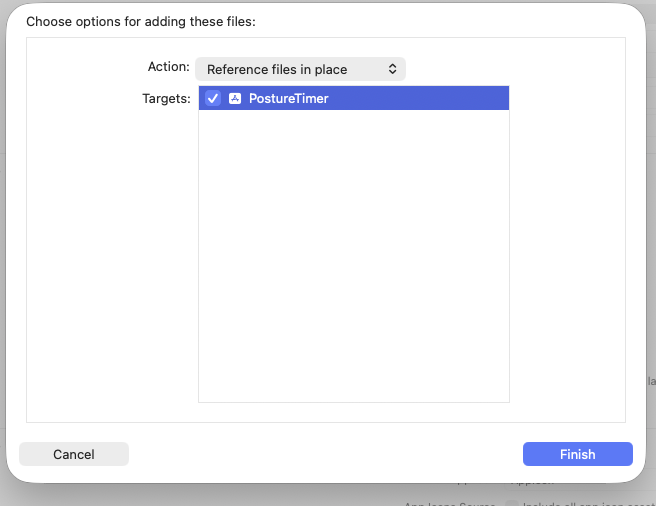

# PostureTimer Swift 実装

SwiftUI + `MenuBarExtra` による macOS ネイティブ実装。

## 要件

- macOS 13.0 (Ventura) 以上
- Xcode 15 以上

## Xcode プロジェクトのセットアップ

`swift build` では `.app` バンドルが生成されないため、Xcode でのビルドが必要。

### 手順

1. Xcode を起動 → File > New > Project
2. macOS > App を選択
3. 以下を設定:
   - Product Name: `PostureTimer`
   - Bundle Identifier: `com.yourname.PostureTimer`
   - Interface: SwiftUI
   - Language: Swift
4. 自動生成されたソースファイル（`ContentView.swift` 等）を削除
5. `Sources/PostureTimer/` 以下のすべての `.swift` ファイルを**参照として**追加（下記参照）
6. `Info.plist` に以下を追加（Dock アイコン非表示）:
   ```xml
   <key>LSUIElement</key>
   <true/>
   ```
7. Deployment Target を macOS 13.0 に設定

### ソースファイルの追加（参照として追加する）

ファイルをコピーせず参照として追加することで、このリポジトリの編集が即座に Xcode に反映される。

1. Xcode のメニュー **File > Add Files to "PostureTimer"...** を開く
2. `swift/Sources/PostureTimer/` 内のすべての `.swift` ファイルを選択
3. Action: 「Reference files in place」を選択する
    


> すでにコピーしてしまった場合は、プロジェクトナビゲーターで該当ファイルを選択して Delete →
> 「Remove Reference」（ファイルは削除しない）を選んだあと、上記手順で再追加する。

### Info.plist の設定

Xcode 14 以降では Info.plist がデフォルトで非表示のため、
`TARGETS > Info > Custom macOS Application Target Properties` で設定するか、
`Info.plist` ファイルをプロジェクトに追加する。

必須エントリ:

| Key | Value |
|-----|-------|
| `LSUIElement` | `YES` |

任意エントリ（Finder の「情報を見る」に表示される著作権表示）:

| Info.plist Key | Xcode の表示名 | Value |
|---|---|---|
| `NSHumanReadableCopyright` | `Copyright (human-readable)` | `Copyright (c) 2026 ykich` |

### 通知の許可

初回起動時にシステムの通知許可ダイアログが表示される。
許可しなかった場合は、システム設定 > 通知 > PostureTimer で手動許可が必要。

## ビルド

Xcode でプロジェクトを開き `Cmd + B` でビルド、`Cmd + R` で実行。

`.app` を `Applications` フォルダにコピーするには:

```bash
cp -R ~/Library/Developer/Xcode/DerivedData/PostureTimer-*/Build/Products/Debug/PostureTimer.app /Applications/
```

## データ保存先

設定値は macOS の `UserDefaults` に保存される（`appConfig` キー配下に `sit_alert_minutes` / `stand_alert_minutes` / `repeat_interval_minutes` / ホットキー設定）。
